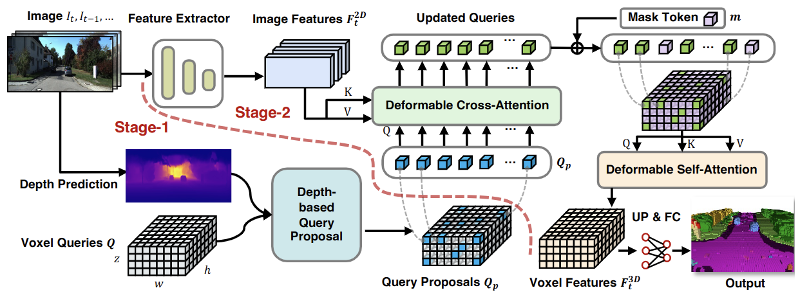

<div align="center">   
  
# Optimized VoxFormer: Enhanced Feature Extraction for 3D Semantic Scene Completion
</div>


> **VoxFormer: Sparse Voxel Transformer for Camera-based 3D Semantic Scene Completion**, CVPR 2023.
> 
> This repository hosts the optimized version of VoxFormer, incorporating efficient feature extraction methods to enhance performance in resource-constrained environments.

## Introduction

Autonomous vehicles require comprehensive 3D scene understanding for effective planning and mapping. Semantic Scene Completion (SSC) plays a vital role by inferring the complete 3D geometry and semantics of a scene from limited 2D perspectives captured by vehicle cameras. Our project builds on the existing VoxFormer model by optimizing its architecture to reduce computational load while maintaining competitive performance.

## Key Improvements

- **Feature Extractor Optimization**:
  - Replaced the original ResNet-based feature extractor with MobileNet, reducing the model's parameter count by fivefold.
  - Significant improvement in processing speed and resource efficiency, making the model more suitable for real-time applications.

- **Comparative Analysis**:
  - The optimized model, VoxFormer-S, was benchmarked against the original VoxFormer-T and the MonoScene detection model.
  - Demonstrated competitive performance, particularly in short-range scenarios crucial for autonomous vehicle navigation.

## Methodology

|  | 
|:--:| 
| **Figure 1. Overall framework of VoxFormer-S.** Given RGB images, features are extracted using MobileNet, followed by depth estimation and voxel query proposal. The transformer-based architecture then completes the scene with semantic segmentation.|

### Summary of Changes

1. **Model Simplification**: VoxFormer-S processes a single image at a time, reducing the computational overhead.
2. **Training Optimization**: Streamlined training process with fewer epochs and smaller sample sizes.
3. **Memory Management**: Implemented memory mapping techniques to handle large datasets efficiently.

### Evaluation Metrics

The following table summarizes the performance of the optimized VoxFormer-S model compared to MonoScene:

| Method      | Range (m) | IoU (%) | mIoU (%) |
|-------------|-----------|---------|----------|
| MonoScene   | 12.8      | 38.50   | 12.30    |
| VoxFormer-S | 12.8      | 66.21   | 21.36    |

### Future Work

We plan to extend this work by conducting a thorough comparative analysis with other 3D object detection models like VoxelFormer and TPVFormer. Additionally, we aim to refine the model further to improve its performance over longer ranges.

## Getting Started

- [Installation](docs/install.md) 
- [Prepare Dataset](docs/prepare_dataset.md)
- [Run and Eval](docs/getting_started.md)

## Model Zoo

The optimized VoxFormer-S model is available for download:

| Backbone | Method      | IoU | mIoU | Config | Download |
|:--------:|:-----------:|:---:|:----:|:------:|:--------:|
| MobileNet| VoxFormer-S | 66.21| 21.36| [config](projects/configs/voxformer/voxformer-S.py) | [model](https://drive.google.com/file/d/1UBemF77Cfr0d9rcC_Y9Qmjnqp_c4qoeb/view?usp=share_link) |

## Dataset

- [x] SemanticKITTI
- [ ] KITTI-360
- [ ] nuScenes

## BibTeX

If this work is helpful for your research, please cite the following BibTeX entry:

```bibtex
@InProceedings{li2023voxformer,
      title={VoxFormer: Sparse Voxel Transformer for Camera-based 3D Semantic Scene Completion}, 
      author={Li, Yiming and Yu, Zhiding and Choy, Christopher and Xiao, Chaowei and Alvarez, Jose M and Fidler, Sanja and Feng, Chen and Anandkumar, Anima},
      booktitle = {Proceedings of the IEEE/CVF Conference on Computer Vision and Pattern Recognition (CVPR)},
      year={2023}
}
